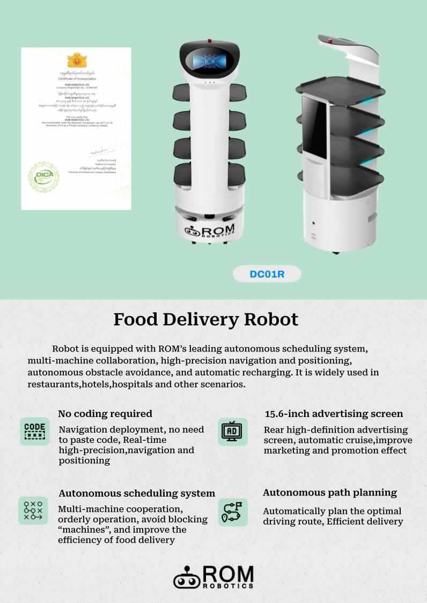
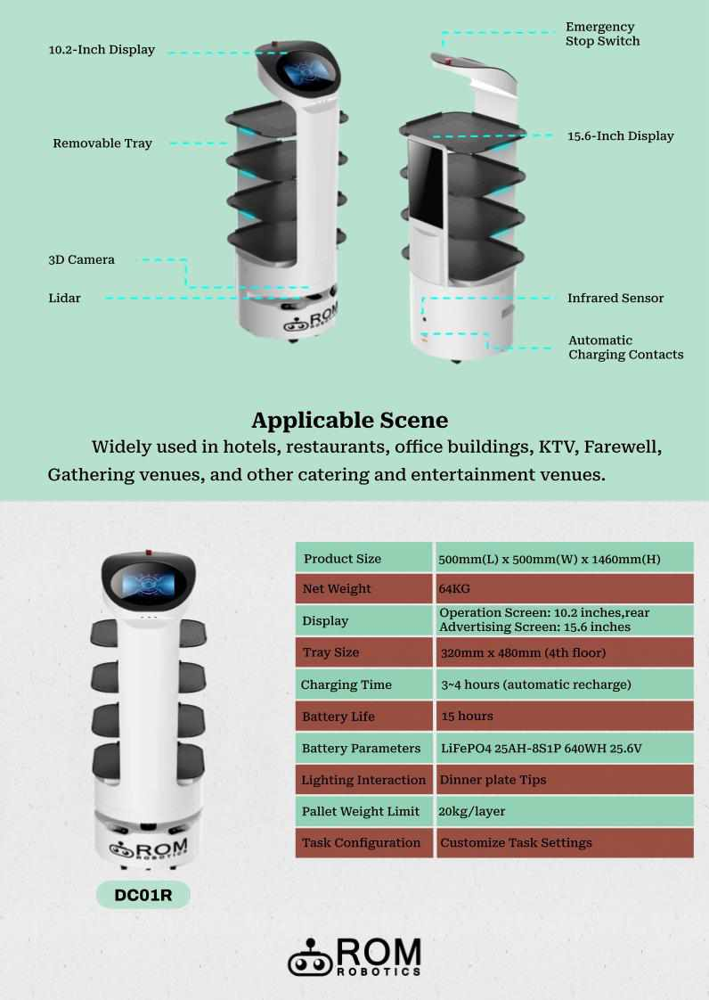
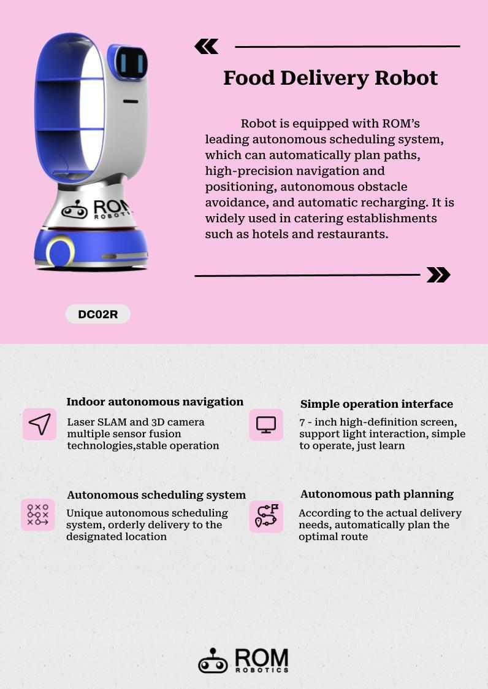
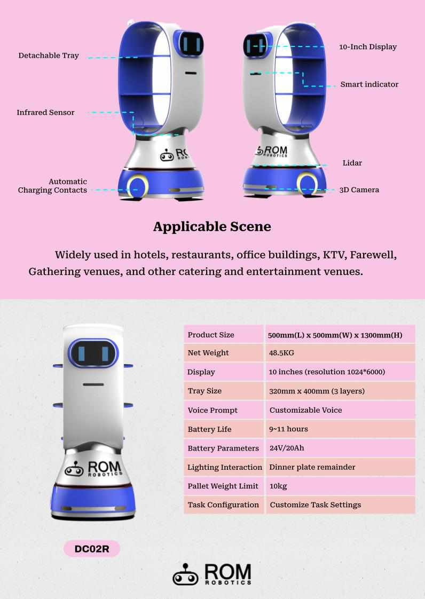
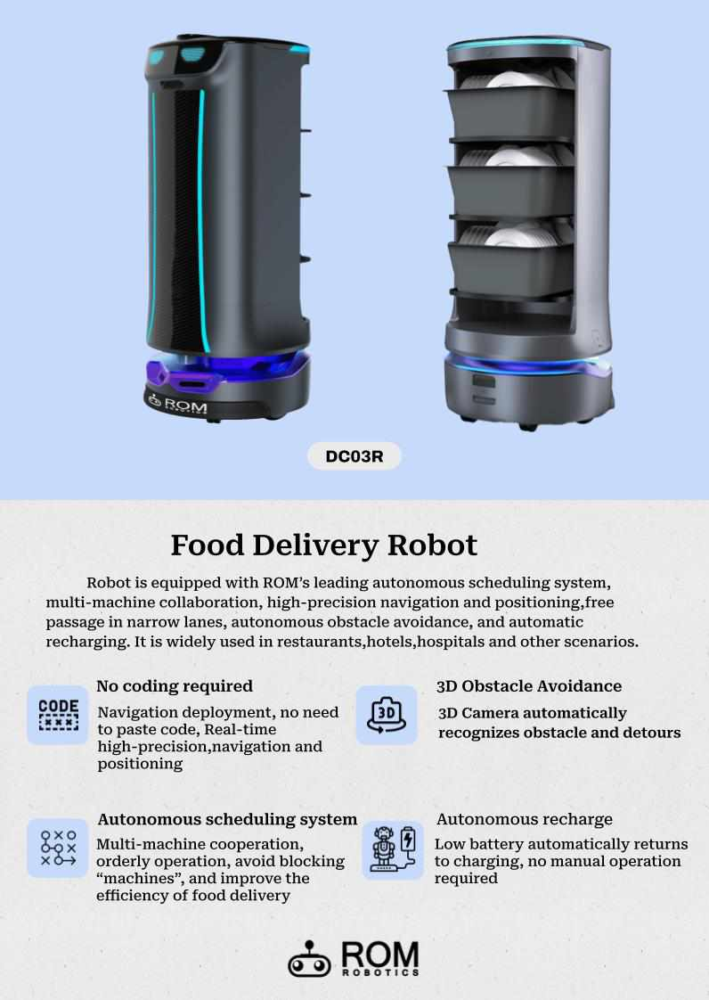
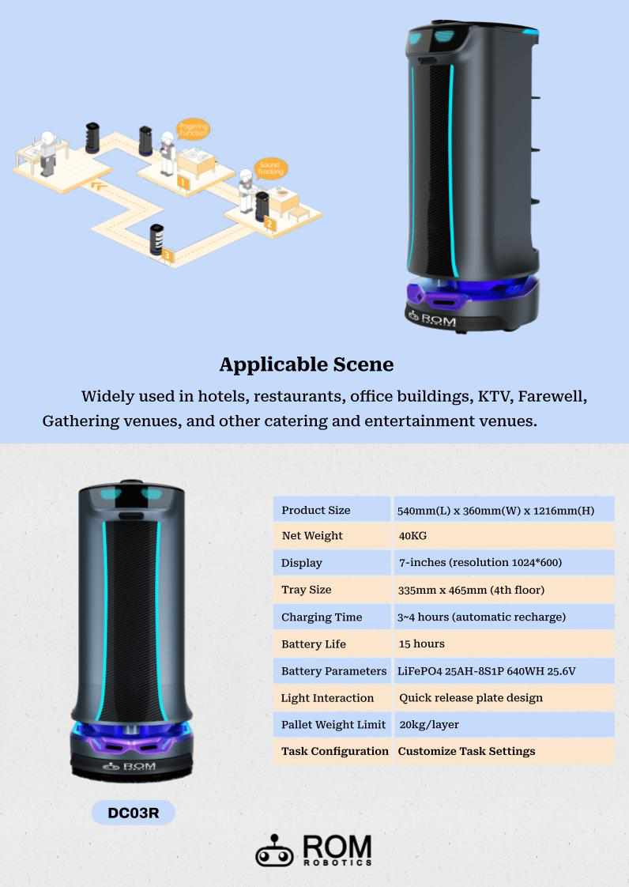

## Mobile Robot System & Services

<!-- Slideshow container -->
<div class="slideshow-container">

  <!-- Full-width images with number and caption text -->
  <div class="mySlides fade">
    <div class="numbertext">1 / 6</div>
    
    <div class="text">DC01R</div>
  </div>

  <div class="mySlides fade">
    <div class="numbertext">2 / 6</div>
    
    <div class="text">DC01R</div>
  </div>

  <div class="mySlides fade">
    <div class="numbertext">3 / 6</div>
    
    <div class="text">DC02R</div>
  </div>

  <div class="mySlides fade">
    <div class="numbertext">4 / 6</div>
    
    <div class="text">DC02R_2</div>
  </div>

  <div class="mySlides fade">
    <div class="numbertext">5 / 6</div>
    
    <div class="text">DC03R</div>
  </div>

  <div class="mySlides fade">
    <div class="numbertext">6 / 6</div>
    
    <div class="text">DC03R_2</div>
  </div>

  <!-- Next and previous buttons -->
  <a class="prev" onclick="plusSlides(-1)">&#10094;</a>
  <a class="next" onclick="plusSlides(1)">&#10095;</a>
</div>
<br>

<!-- The dots/circles -->
<div style="text-align:center">
  <span class="dot" onclick="currentSlide(1)"></span>
  <span class="dot" onclick="currentSlide(2)"></span>
  <span class="dot" onclick="currentSlide(3)"></span>
</div>


```
OPENSOURCE & ROS2 support
```

<script>
  let slideIndex = 0;
showSlides();

function showSlides() {
  let i;
  let slides = document.getElementsByClassName("mySlides");
  for (i = 0; i < slides.length; i++) {
    slides[i].style.display = "none";
  }
  slideIndex++;
  if (slideIndex > slides.length) {slideIndex = 1}
  slides[slideIndex-1].style.display = "block";
  setTimeout(showSlides, 5000); // Change image every 2 seconds
}
</script>